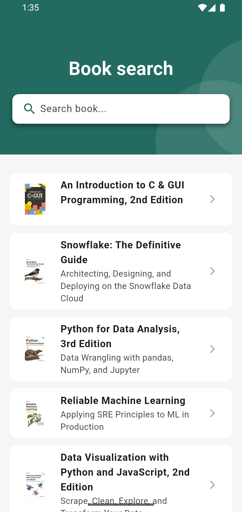
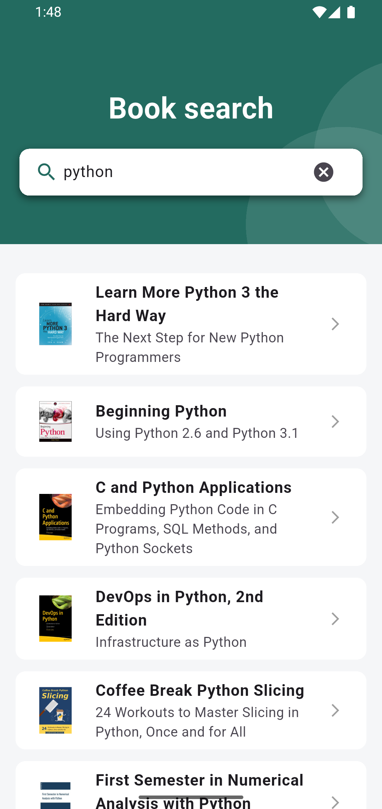
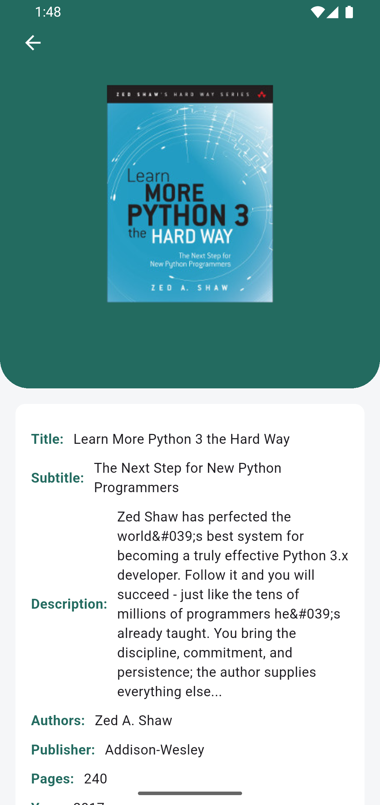

# 📚 Book Search App

A mobile application built with **Flutter**, allowing users to search for books, view results, and consult details of each book. The data is fetched from a backend exposed through an API, and its deployment is designed using AWS services.

# ☁️ Backend Solution on AWS

Below is the proposed architecture for implementing the backend in the cloud, accessible through an API and designed to be scalable.


| Service               | Description                                                                                       |
| --------------------- | ------------------------------------------------------------------------------------------------- |
| **API Gateway**       | Exposes endpoints. Receives requests from the mobile app and routes them to AWS Lambda.           |
| **AWS Lambda**        | Backend logic. Processes requests and interacts with the database or storage services.            |
| **Amazon DynamoDB**   | NoSQL database storing book information (title, description, ISBN, etc.).                         |
| **Amazon S3**         | Stores images associated with books to be consumed by the app.                                    |
| **Amazon CloudWatch** | Monitoring and logging for Lambda and API Gateway to provide control, traceability, and analysis. |

## Funcionalidades

|  |  |  |
| ----------------------------- | ------------------------------- | --------------------------------- |

- Search for books by name or keyword.
- View details of the selected book.
- In-memory cache storage of the last 5 searches to improve future search performance.

## Technologies Used

- **Flutter** (version 3.22.0)
- **Riverpod / Provider** for state management.
- **Dart**
- **GET IT** (Dependency Injection)
- **DIO** (HTTP client)

## Installation

1. Clone the repository:

```bash
git clone <url>
cd book-search
```

2. Install dependencies:

```bash
flutter pub get
```

3. Configure your `.env` file with backend URLs.

4. Run the project:

```bash
flutter run
```

## Testing

```
flutter test
```

## Project Structure

```vbnet
lib/
├── config/
├── features/
│   └── books/
│       ├── domain/
│       ├── infrastructure/
│       └── presentation/
│           ├── screens/
│           ├── widgets/
│           └── providers/
├── shared/
├── init_dependencies.dart
├── main_widget.dart
└── main.dart

test/

```

## Author

Developed by **Julián Ocampo Vélez**
